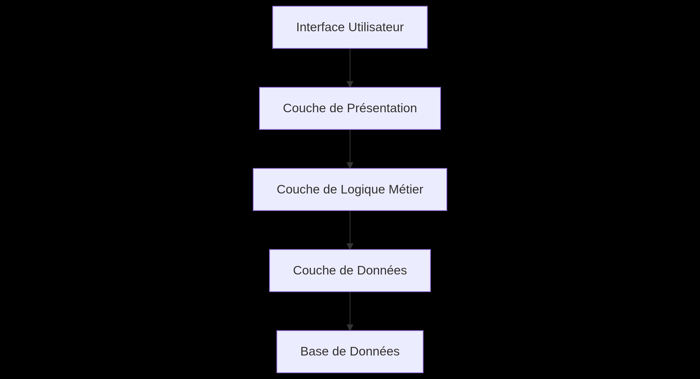
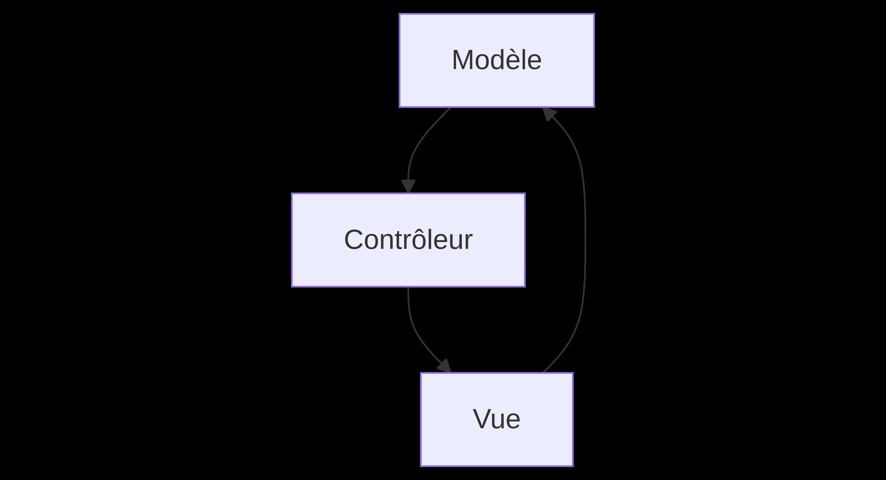
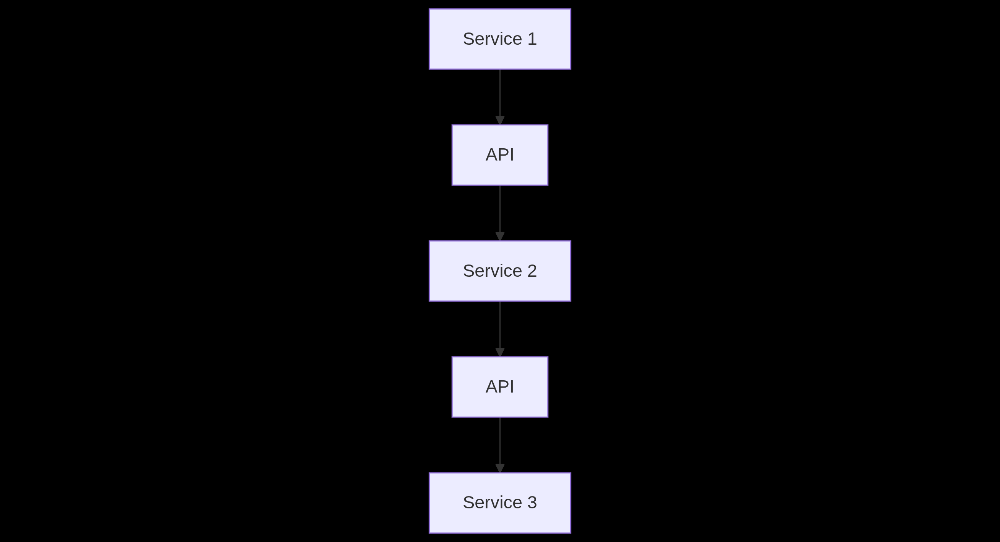

# .NET

[Learning .NET](./dotnet-learning-path)

## Types de projets avec la CLI .NET

La CLI .NET (`dotnet`) permet de créer rapidement différents types de projets, chacun adapté à un cas d’usage spécifique.

| Type de Projet | Commande CLI | Description | Structure typique | Cas d’usage |
| --- | --- | --- | --- | --- |
| Application Console | `dotnet new console` | Application exécutée en ligne de commande | `Program.cs`, `.csproj` | Scripts, outils CLI |
| Application Web | `dotnet new web` | Application web ASP.NET Core | `Controllers/`, `Views/`, `Models/`, `.csproj` | Sites web, applications interactives |
| API Web | `dotnet new webapi` | API RESTful avec ASP.NET Core | `Controllers/`, `Models/`, `.csproj` | Services backend, microservices |
| Application Mobile | `dotnet new maui` | Application multiplateforme mobile | `MainPage.xaml`, `App.xaml`, `.csproj` | Applications mobiles |
| Bibliothèque | `dotnet new classlib` | Bibliothèque de classes réutilisables | `Class1.cs`, `.csproj` | Composants logiciels, frameworks |
| Tests Unitaires | `dotnet new mstest` ou `dotnet new xunit` | Projets de tests unitaires | `UnitTest1.cs`, `.csproj` | Tests automatisés, assurance qualité |

## Architecture en Couches

L’architecture en couches sépare les responsabilités en plusieurs couches : présentation, logique métier, accès aux données, base de données. Cela facilite la maintenance et l’évolutivité.



- **Avantages** : séparation claire des responsabilités, facilite la maintenance et l’évolutivité.
- **Exemple** : application console avec injection de dépendances (`IService`, `Service`, `Repository`).
- **Exemple complet**

### 1. Introduction à l’Architecture en Couches

L’architecture en couches est un modèle de conception qui sépare les responsabilités d’une application en plusieurs couches logiques. Chaque couche a un rôle précis et communique uniquement avec la couche directement inférieure ou supérieure. Cela permet une meilleure maintenabilité, testabilité et évolutivité du code.

**Couches typiques :**

- **Models** : Représente les données et la logique métier.
- **Repository** : Gère l’accès aux données (base de données, API, etc.).
- **Services** : Contient la logique métier et les règles de gestion.
- **Controller** : Gère les requêtes HTTP et interagit avec les services.

### 2. Exemple Concret : Gestion des Utilisateurs

#### 2.1. Modèle (Model)

Le modèle représente les données et peut inclure des validations ou de la logique métier simple.

```csharp
// Models/User.cs
public class User
{
    public int Id { get; set; }
    public string FirstName { get; set; }
    public string LastName { get; set; }
    public string Email { get; set; }
    public DateTime CreatedAt { get; set; } = DateTime.Now;

    // Exemple de validation simple
    public bool IsValid()
    {
        return !string.IsNullOrEmpty(FirstName) &&
                !string.IsNullOrEmpty(LastName) &&
                !string.IsNullOrEmpty(Email) &&
                Email.Contains("@");
    }
}
```

**Rôle :**

- Définir la structure des données.
- Inclure des validations ou de la logique métier simple.

#### 2.2. Repository

Le repository est responsable de l’accès aux données. Il isole la logique d’accès à la base de données du reste de l’application.

```csharp
// Repositories/IUserRepository.cs
public interface IUserRepository
{
    User GetById(int id);
    IEnumerable<User> GetAll();
    void Add(User user);
    void Update(User user);
    void Delete(int id);
}

// Repositories/UserRepository.cs
public class UserRepository : IUserRepository
{
    private readonly List<User> _users = new List<User>();
    private int _nextId = 1;

    public User GetById(int id)
    {
        return _users.FirstOrDefault(u => u.Id == id);
    }

    public IEnumerable<User> GetAll()
    {
        return _users;
    }

    public void Add(User user)
    {
        user.Id = _nextId++;
        _users.Add(user);
    }

    public void Update(User user)
    {
        var existingUser = _users.FirstOrDefault(u => u.Id == user.Id);
        if (existingUser != null)
        {
            existingUser.FirstName = user.FirstName;
            existingUser.LastName = user.LastName;
            existingUser.Email = user.Email;
        }
    }

    public void Delete(int id)
    {
        var user = _users.FirstOrDefault(u => u.Id == id);
        if (user != null)
        {
            _users.Remove(user);
        }
    }
}
```

**Rôle :**

- Accéder aux données (base de données, fichier, API, etc.).
- Isoler la logique d’accès aux données.
- Faciliter les tests en utilisant des interfaces.

#### 2.3. Service

Le service contient la logique métier et utilise le repository pour accéder aux données.

```csharp
// Services/IUserService.cs
public interface IUserService
{
    User GetUser(int id);
    IEnumerable<User> GetAllUsers();
    void CreateUser(User user);
    void UpdateUser(User user);
    void DeleteUser(int id);
}

// Services/UserService.cs
public class UserService : IUserService
{
    private readonly IUserRepository _userRepository;

    public UserService(IUserRepository userRepository)
    {
        _userRepository = userRepository;
    }

    public User GetUser(int id)
    {
        return _userRepository.GetById(id);
    }

    public IEnumerable<User> GetAllUsers()
    {
        return _userRepository.GetAll();
    }

    public void CreateUser(User user)
    {
        if (!user.IsValid())
        {
            throw new ArgumentException("L'utilisateur n'est pas valide.");
        }
        _userRepository.Add(user);
    }

    public void UpdateUser(User user)
    {
        if (!user.IsValid())
        {
            throw new ArgumentException("L'utilisateur n'est pas valide.");
        }
        _userRepository.Update(user);
    }

    public void DeleteUser(int id)
    {
        _userRepository.Delete(id);
    }
}
```

**Rôle :**

- Implémenter la logique métier.
- Valider les données avant de les transmettre au repository.
- Coordonner les opérations entre plusieurs repositories si nécessaire.

#### 2.4. Controller

Le controller gère les requêtes HTTP et interagit avec les services.

```csharp
// Controllers/UsersController.cs
[ApiController]
[Route("api/[controller]")]
public class UsersController : ControllerBase
{
    private readonly IUserService _userService;

    public UsersController(IUserService userService)
    {
        _userService = userService;
    }

    [HttpGet("{id}")]
    public ActionResult<User> GetUser(int id)
    {
        var user = _userService.GetUser(id);
        if (user == null)
        {
            return NotFound();
        }
        return Ok(user);
    }

    [HttpGet]
    public ActionResult<IEnumerable<User>> GetAllUsers()
    {
        return Ok(_userService.GetAllUsers());
    }

    [HttpPost]
    public IActionResult CreateUser([FromBody] User user)
    {
        try
        {
            _userService.CreateUser(user);
            return CreatedAtAction(nameof(GetUser), new { id = user.Id }, user);
        }
        catch (ArgumentException ex)
        {
            return BadRequest(ex.Message);
        }
    }

    [HttpPut("{id}")]
    public IActionResult UpdateUser(int id, [FromBody] User user)
    {
        if (id != user.Id)
        {
            return BadRequest("L'ID de l'utilisateur ne correspond pas.");
        }

        try
        {
            _userService.UpdateUser(user);
            return NoContent();
        }
        catch (ArgumentException ex)
        {
            return BadRequest(ex.Message);
        }
    }

    [HttpDelete("{id}")]
    public IActionResult DeleteUser(int id)
    {
        _userService.DeleteUser(id);
        return NoContent();
    }
}
```

**Rôle :**

- Recevoir les requêtes HTTP.
- Appeler les services pour traiter les requêtes.
- Retourner les réponses HTTP appropriées.

#### 3. Injection de Dépendances

Pour que les couches communiquent entre elles, on utilise l’injection de dépendances (DI). Cela permet de découpler les composants et de faciliter les tests.

**Exemple de configuration dans `Program.cs` :**

```csharp
// Program.cs
var builder = WebApplication.CreateBuilder(args);

// Ajouter les services au conteneur DI
builder.Services.AddScoped<IUserRepository, UserRepository>();
builder.Services.AddScoped<IUserService, UserService>();

builder.Services.AddControllers();
var app = builder.Build();

app.MapControllers();
app.Run();
```

**Avantages :**

- Découplage des composants.
- Facilité de test (remplacement des dépendances par des mocks).
- Gestion centralisée des dépendances.

#### 4. Exemple de Test Unitaire

Voici un exemple de test unitaire pour le service `UserService` en utilisant un mock du repository.

```csharp
// Tests/UserServiceTests.cs
[TestClass]
public class UserServiceTests
{
    [TestMethod]
    public void CreateUser_WithValidUser_AddsUserToRepository()
    {
        // Arrange
        var mockRepository = new Mock<IUserRepository>();
        var userService = new UserService(mockRepository.Object);
        var user = new User { FirstName = "Antoine", LastName = "Coulon", Email = "antoine@example.com" };

        // Act
        userService.CreateUser(user);

        // Assert
        mockRepository.Verify(r => r.Add(It.IsAny<User>()), Times.Once);
    }

    [TestMethod]
    [ExpectedException(typeof(ArgumentException))]
    public void CreateUser_WithInvalidUser_ThrowsException()
    {
        // Arrange
        var mockRepository = new Mock<IUserRepository>();
        var userService = new UserService(mockRepository.Object);
        var user = new User { FirstName = "", LastName = "Coulon", Email = "antoine@example.com" };

        // Act
        userService.CreateUser(user);
    }
}
```

**Outils de test recommandés :**

- **Moq** : Pour créer des mocks.
- **xUnit** ou **MSTest** : Pour écrire les tests.

#### 5. Résumé des Responsabilités

**Model** : Définir la structure des données et inclure des validations simples.

**Repository** : Gérer l’accès aux données (CRUD).

**Service** : Implémenter la logique métier et valider les données.

**Controller** : Gérer les requêtes HTTP et interagir avec les services.

#### 6. Ressources Complémentaires

- **Documentation officielle** : [Dependency Injection in ASP.NET Core](https://learn.microsoft.com/fr-fr/aspnet/core/fundamentals/dependency-injection)
- **Tutoriels** : [Microsoft Learn - Create a web API with ASP.NET Core](https://learn.microsoft.com/fr-fr/aspnet/core/tutorials/first-web-api)
- **Livres** : *Clean Architecture* (Robert C. Martin), *Dependency Injection Principles, Practices, and Patterns* (Steven van Deursen, Mark Seemann)

## Architecture MVC

L’architecture MVC (Modèle-Vue-Contrôleur) sépare la logique métier (Modèle), l’interface utilisateur (Vue) et la gestion des interactions (Contrôleur).



- **Avantages** : facilite la maintenance, la réutilisation du code, et la collaboration.
- **Exemple** : application web ASP.NET MVC.
- **Exemple complet**

### 1.1. Introduction à l’Architecture MVC

L’architecture **MVC** (Modèle-Vue-Contrôleur) est un modèle de conception qui sépare une application en trois composants principaux :

- **Modèle** : Gère les données et la logique métier.
- **Vue** : Affiche l’interface utilisateur.
- **Contrôleur** : Traite les entrées de l’utilisateur et coordonne les interactions entre le modèle et la vue.

**Avantages :**

- Séparation claire des responsabilités.
- Facilité de maintenance et d’évolutivité.
- Réutilisabilité du code.

### 1.2. Exemple Concret : Application de Gestion des Tâches

#### **1.2.1. Modèle (Model)**

Le modèle représente les données et la logique métier.

```csharp
// Models/Task.cs
public class Task
{
    public int Id { get; set; }
    public string Title { get; set; }
    public string Description { get; set; }
    public DateTime DueDate { get; set; }
    public bool IsCompleted { get; set; }

    public bool IsOverdue()
    {
        return DueDate < DateTime.Now && !IsCompleted;
    }
}
```

**Rôle :**

- Définir la structure des données.
- Inclure des méthodes pour manipuler les données (ex. : `IsOverdue`).

#### 1.2.2. Vue (View)

La vue est responsable de l’affichage des données à l’utilisateur. En ASP.NET Core, les vues sont généralement des fichiers `.cshtml` (Razor).

```csharp
@model IEnumerable<Task>

<h1>Liste des tâches</h1>
<table class="table">
    <thead>
        <tr>
            <th>Titre</th>
            <th>Description</th>
            <th>Date limite</th>
            <th>Statut</th>
        </tr>
    </thead>
    <tbody>
        @foreach (var task in Model)
        {
            <tr>
                <td>@task.Title</td>
                <td>@task.Description</td>
                <td>@task.DueDate.ToShortDateString()</td>
                <td>
                    @if (task.IsCompleted)
                    {
                        <span class="badge bg-success">Terminée</span>
                    }
                    else if (task.IsOverdue())
                    {
                        <span class="badge bg-danger">En retard</span>
                    }
                    else
                    {
                        <span class="badge bg-warning">En cours</span>
                    }
                </td>
            </tr>
        }
    </tbody>
</table>
```

**Rôle :**

- Afficher les données de manière conviviale.
- Permettre à l’utilisateur d’interagir avec l’application.

#### 1.2.3. Contrôleur (Controller)

Le contrôleur gère les requêtes HTTP et interagit avec le modèle et la vue.

```csharp
// Controllers/TasksController.cs
public class TasksController : Controller
{
    private static List<Task> _tasks = new List<Task>
    {
        new Task { Id = 1, Title = "Faire les courses", Description = "Acheter du lait et des œufs", DueDate = DateTime.Now.AddDays(2) },
        new Task { Id = 2, Title = "Réviser C#", Description = "Lire la documentation sur l'architecture MVC", DueDate = DateTime.Now.AddDays(1) }
    };

    public IActionResult Index()
    {
        return View(_tasks);
    }

    public IActionResult Details(int id)
    {
        var task = _tasks.FirstOrDefault(t => t.Id == id);
        if (task == null)
        {
            return NotFound();
        }
        return View(task);
    }

    [HttpPost]
    public IActionResult Create(Task task)
    {
        task.Id = _tasks.Max(t => t.Id) + 1;
        _tasks.Add(task);
        return RedirectToAction(nameof(Index));
    }
}
```

**Rôle :**

- Recevoir les requêtes HTTP.
- Récupérer ou mettre à jour les données via le modèle.
- Transmettre les données à la vue pour affichage.

#### 1.2.4. Diagramme de Flux MVC

```mermaid
graph TD
    A[Vue] |Interaction utilisateur| B[Contrôleur]
    B|Récupère/Met à jour les données| C[Modèle]
    C =Retourne les données| B
    B |Affiche les données| A
```

#### 1.2.5. Bonnes Pratiques MVC

- **Modèle** : Garder le modèle simple et éviter d’y inclure de la logique d’affichage.
- **Vue** : Utiliser des vues partielles pour réutiliser des composants.
- **Contrôleur** : Éviter d’inclure de la logique métier complexe (utiliser des services si nécessaire).
- **Validation** : Utiliser les attributs de validation (`[Required]`, `[StringLength]`) dans le modèle.

#### 1.2.6. Exemple de Validation

```csharp
// Models/Task.cs
public class Task
{
    [Required(ErrorMessage = "Le titre est obligatoire.")]
    public string Title { get; set; }

    [StringLength(500, ErrorMessage = "La description ne peut pas dépasser 500 caractères.")]
    public string Description { get; set; }
}
```

#### 1.2.7. Configuration de l’Application

Dans `Program.cs`, configurez les services MVC :

```csharp
var builder = WebApplication.CreateBuilder(args);
builder.Services.AddControllersWithViews();
var app = builder.Build();

app.MapControllerRoute(
    name: "default",
    pattern: "{controller=Tasks}/{action=Index}/{id?}");

app.Run();
```

#### 1.2.8. Ressources Complémentaires

- **Documentation** : [ASP.NET Core MVC](https://learn.microsoft.com/fr-fr/aspnet/core/mvc/overview)
- **Tutoriel** : [Créer une application MVC avec ASP.NET Core](https://learn.microsoft.com/fr-fr/aspnet/core/tutorials/first-mvc-app/)

## Architecture Microservices

L’architecture microservices décompose une application en petits services indépendants, communiquant via des API.



- **Avantages** : évolutivité, indépendance des services, facilite le déploiement et la maintenance.
- **Exemple** : application distribuée avec plusieurs services spécialisés.
- **Exemple complet**

### 2.1. Introduction aux Microservices

L’architecture **Microservices** décompose une application en petits services indépendants, chacun ayant sa propre responsabilité et communiquant via des API (généralement REST ou gRPC).

**Avantages :**

- Évolutivité : Chaque service peut être mis à l’échelle indépendamment.
- Flexibilité : Les services peuvent être développés avec des technologies différentes.
- Résilience : Une panne dans un service n’affecte pas les autres.

### 2.2. Exemple Concret : Application de Blog avec Deux Services

- **Service 1** : Gestion des articles.
- **Service 2** : Gestion des commentaires.

#### 2.2.1. Modèle pour le Service d’Articles

```csharp
// Models/Article.cs (Service Articles)
public class Article
{
    public int Id { get; set; }
    public string Title { get; set; }
    public string Content { get; set; }
    public DateTime PublishedDate { get; set; }
}
```

#### 2.2.2. Contrôleur pour le Service d’Articles

```csharp
// Controllers/ArticlesController.cs (Service Articles)
[ApiController]
[Route("api/[controller]")]
public class ArticlesController : ControllerBase
{
    private static List<Article> _articles = new List<Article>
    {
        new Article { Id = 1, Title = "Introduction aux Microservices", Content = "Les microservices sont une architecture...", PublishedDate = DateTime.Now }
    };

    [HttpGet]
    public IActionResult GetAll()
    {
        return Ok(_articles);
    }

    [HttpGet("{id}")]
    public IActionResult GetById(int id)
    {
        var article = _articles.FirstOrDefault(a => a.Id == id);
        if (article == null)
        {
            return NotFound();
        }
        return Ok(article);
    }
}
```

#### 2.2.3. Modèle pour le Service de Commentaires

```csharp
// Models/Comment.cs (Service Commentaires)
public class Comment
{
    public int Id { get; set; }
    public int ArticleId { get; set; }
    public string Author { get; set; }
    public string Content { get; set; }
    public DateTime PostedDate { get; set; }
}
```

#### 2.2.4. Contrôleur pour le Service de Commentaires

```csharp
// Controllers/CommentsController.cs (Service Commentaires)
[ApiController]
[Route("api/[controller]")]
public class CommentsController : ControllerBase
{
    private static List<Comment> _comments = new List<Comment>
    {
        new Comment { Id = 1, ArticleId = 1, Author = "Antoine", Content = "Merci pour cet article !", PostedDate = DateTime.Now }
    };

    [HttpGet("article/{articleId}")]
    public IActionResult GetByArticleId(int articleId)
    {
        var comments = _comments.Where(c => c.ArticleId == articleId).ToList();
        return Ok(comments);
    }
}
```

#### 2.2.5. Communication entre Services

Pour récupérer les commentaires d’un article, le service d’articles peut appeler le service de commentaires via une requête HTTP.

```csharp
// Services/CommentService.cs (Service Articles)
public class CommentService
{
    private readonly HttpClient _httpClient;

    public CommentService(HttpClient httpClient)
    {
        _httpClient = httpClient;
    }

    public async Task<List<Comment>> GetCommentsForArticle(int articleId)
    {
        var response = await _httpClient.GetAsync($"http://comment-service/api/comments/article/{articleId}");
        response.EnsureSuccessStatusCode();
        return await response.Content.ReadFromJsonAsync<List<Comment>>();
    }
}
```

**Configuration dans `Program.cs` :**

```csharp
builder.Services.AddHttpClient<CommentService>();
```

#### 2.2.6. Diagramme de Flux Microservices

```mermaid
graph TD
    A[Client] Requête| B[Service Articles]
    B Requête| C[Service Commentaires]
    C Retourne les commentaires| B
    B Retourne les données| A
```

#### 2.2.7. Bonnes Pratiques Microservices

- **Indépendance** : Chaque service doit avoir sa propre base de données.
- **Communication** : Utiliser des API REST ou gRPC pour la communication inter-services.
- **Résilience** : Implémenter des mécanismes de gestion des erreurs (ex. : Polly pour les retries).
- **Découverte de services** : Utiliser un service registry (ex. : Consul, Eureka).

#### 2.2.8. Exemple de Résilience avec Polly

```csharp
// Services/CommentService.cs
public class CommentService
{
    private readonly HttpClient _httpClient;
    private readonly ILogger<CommentService> _logger;

    public CommentService(HttpClient httpClient, ILogger<CommentService> logger)
    {
        _httpClient = httpClient;
        _logger = logger;
    }

    public async Task<List<Comment>> GetCommentsForArticle(int articleId)
    {
        var retryPolicy = Policy<List<Comment>>
            .Handle<HttpRequestException>()
            .RetryAsync(3, onRetry => _logger.LogWarning($"Retrying to fetch comments..."));

        return await retryPolicy.ExecuteAsync(async () =>
        {
            var response = await _httpClient.GetAsync($"http://comment-service/api/comments/article/{articleId}");
            response.EnsureSuccessStatusCode();
            return await response.Content.ReadFromJsonAsync<List<Comment>>();
        });
    }
}
```

#### 2.2.9. Déploiement et Orchestration

- **Conteneurisation** : Utiliser Docker pour conteneuriser chaque service.
- **Orchestration** : Utiliser Kubernetes ou Docker Swarm pour gérer les conteneurs.
- **CI/CD** : Automatiser le déploiement avec GitHub Actions ou Azure DevOps.

#### 2.2.10. Ressources Complémentaires

- **Documentation** : [Microservices avec .NET](https://learn.microsoft.com/fr-fr/dotnet/architecture/microservices/)
- **Outil** : [Docker](https://www.docker.com/), [Kubernetes](https://kubernetes.io/)
- **Livre** : *Microservices Patterns* (Chris Richardson)

## Domain-Driven Design (DDD)

### 1. Introduction au Domain-Driven Design (DDD)

Le **Domain-Driven Design** est une approche de conception logicielle qui met l’accent sur le **domaine métier** et sa logique. L’objectif est de créer un modèle logiciel qui reflète fidèlement les concepts, les règles et les processus du domaine réel. Le DDD est particulièrement utile pour les applications complexes où la logique métier est riche et évolutive.

**Concepts clés du DDD :**

- **Ubiquitous Language** : Un langage commun entre les développeurs et les experts métier.
- **Bounded Context** : Un contexte délimité où les termes et les règles du domaine ont un sens précis.
- **Entités** : Objets définis par leur identité (ex. : un utilisateur, une commande).
- **Value Objects** : Objets définis par leurs attributs (ex. : une adresse, une date).
- **Aggregates** : Groupes d’objets traités comme une unité cohérente pour garantir la cohérence des données.
- **Domain Services** : Logique métier qui ne appartient pas à une entité ou un value object spécifique.
- **Repositories** : Interfaces pour accéder aux objets du domaine.
- **Application Services** : Coordonnent les opérations du domaine et gèrent les transactions.

### 2. Structure en Couches du DDD

**Presentation** : Interface utilisateur (API, UI)

**Application** : Coordination des opérations, gestion des transactions

**Domain** : Contient la logique métier pure (entités, value objects, aggregates)

**Infrastructure** : Implémentation technique (persistance, services externes)

### 3. Exemple Concret : Gestion des Commandes

#### 3.1. Définition du Bounded Context

Pour cet exemple, nous allons modéliser un système de **gestion des commandes** pour un site e-commerce.
**Ubiquitous Language :**

- **Commande** : Une demande d’achat passée par un client.
- **Produit** : Un article disponible à la vente.
- **Ligne de Commande** : Un produit avec une quantité dans une commande.
- **Client** : La personne passant la commande.

---

#### 3.2. Couche Domain

**Value Objects** : Les **Value Objects** sont immuables et définis par leurs attributs.

```csharp
// Domain/ValueObjects/Address.cs
public record Address(string Street, string City, string PostalCode, string Country)
{
    public bool IsValid()
    {
        return !string.IsNullOrEmpty(Street) &&
               !string.IsNullOrEmpty(City) &&
               !string.IsNullOrEmpty(PostalCode) &&
               !string.IsNullOrEmpty(Country);
    }
}

// Domain/ValueObjects/ProductId.cs
public record ProductId(Guid Value);
```

**Entités** : Les **Entités** sont définies par leur identité.

```csharp
// Domain/Entities/Customer.cs
public class Customer
{
    public CustomerId Id { get; private set; }
    public string Name { get; private set; }
    public Address Address { get; private set; }

    public Customer(CustomerId id, string name, Address address)
    {
        Id = id;
        Name = name;
        Address = address;
    }
}

// Domain/Entities/Product.cs
public class Product
{
    public ProductId Id { get; private set; }
    public string Name { get; private set; }
    public decimal Price { get; private set; }

    public Product(ProductId id, string name, decimal price)
    {
        Id = id;
        Name = name;
        Price = price;
    }
}
```

**Aggregate Root : Order** : Un **Aggregate** est un groupe d’objets traités comme une unité. Ici, `Order` est l’**aggregate root**.

```csharp
// Domain/Entities/Order.cs
public class Order
{
    public OrderId Id { get; private set; }
    public CustomerId CustomerId { get; private set; }
    public DateTime OrderDate { get; private set; }
    public Address ShippingAddress { get; private set; }
    public IReadOnlyCollection<OrderLine> Lines => _lines.AsReadOnly();
    private readonly List<OrderLine> _lines = new();

    public Order(OrderId id, CustomerId customerId, Address shippingAddress)
    {
        Id = id;
        CustomerId = customerId;
        OrderDate = DateTime.Now;
        ShippingAddress = shippingAddress;
    }

    public void AddLine(ProductId productId, string productName, decimal price, int quantity)
    {
        if (quantity <= 0)
            throw new InvalidOperationException("La quantité doit être supérieure à zéro.");

        var existingLine = _lines.FirstOrDefault(l => l.ProductId == productId);
        if (existingLine != null)
        {
            existingLine.IncreaseQuantity(quantity);
        }
        else
        {
            _lines.Add(new OrderLine(productId, productName, price, quantity));
        }
    }

    public decimal TotalAmount => _lines.Sum(l => l.TotalPrice);
}

// Domain/Entities/OrderLine.cs
public class OrderLine
{
    public ProductId ProductId { get; private set; }
    public string ProductName { get; private set; }
    public decimal Price { get; private set; }
    public int Quantity { get; private set; }

    public OrderLine(ProductId productId, string productName, decimal price, int quantity)
    {
        ProductId = productId;
        ProductName = productName;
        Price = price;
        Quantity = quantity;
    }

    public void IncreaseQuantity(int quantity)
    {
        if (quantity <= 0)
            throw new InvalidOperationException("La quantité doit être supérieure à zéro.");

        Quantity += quantity;
    }

    public decimal TotalPrice => Price * Quantity;
}
```

**Domain Service** : Un **Domain Service** contient la logique métier qui ne appartient pas à une entité spécifique.

```csharp
// Domain/Services/OrderPricingService.cs
public class OrderPricingService
{
    public decimal CalculateShippingCost(Order order)
    {
        // Logique métier pour calculer les frais de livraison
        return order.TotalAmount > 100 ? 0 : 10;
    }
}
```

**Repository Interface** : Le **Repository** est une interface pour accéder aux aggregates.

```csharp
// Domain/Repositories/IOrderRepository.cs
public interface IOrderRepository
{
    Task<Order> GetByIdAsync(OrderId id);
    Task AddAsync(Order order);
    Task UpdateAsync(Order order);
}
```

#### 3.3. Couche Application

**DTOs (Data Transfer Objects)** : Les **DTOs** sont utilisés pour transférer des données entre les couches.

```csharp
// Application/DTOs/OrderDto.cs
public record OrderDto(
    Guid Id,
    Guid CustomerId,
    DateTime OrderDate,
    Address ShippingAddress,
    IEnumerable<OrderLineDto> Lines,
    decimal TotalAmount,
    decimal ShippingCost);

// Application/DTOs/OrderLineDto.cs
public record OrderLineDto(
    Guid ProductId,
    string ProductName,
    decimal Price,
    int Quantity);
```

**Application Service** : Le **Application Service** coordonne les opérations du domaine.

```csharp
// Application/Services/OrderService.cs
public class OrderService
{
    private readonly IOrderRepository _orderRepository;
    private readonly OrderPricingService _pricingService;

    public OrderService(IOrderRepository orderRepository, OrderPricingService pricingService)
    {
        _orderRepository = orderRepository;
        _pricingService = pricingService;
    }

    public async Task<OrderDto> CreateOrderAsync(Guid customerId, Address shippingAddress)
    {
        var order = new Order(new OrderId(Guid.NewGuid()), new CustomerId(customerId), shippingAddress);
        await _orderRepository.AddAsync(order);
        var shippingCost = _pricingService.CalculateShippingCost(order);

        return new OrderDto(
            order.Id.Value,
            order.CustomerId.Value,
            order.OrderDate,
            order.ShippingAddress,
            order.Lines.Select(l => new OrderLineDto(l.ProductId.Value, l.ProductName, l.Price, l.Quantity)),
            order.TotalAmount,
            shippingCost);
    }

    public async Task AddProductToOrderAsync(Guid orderId, Guid productId, string productName, decimal price, int quantity)
    {
        var order = await _orderRepository.GetByIdAsync(new OrderId(orderId));
        order.AddLine(new ProductId(productId), productName, price, quantity);
        await _orderRepository.UpdateAsync(order);
    }
}
```

#### 3.4. Couche Infrastructure

**Implémentation du Repository** : Implémentation concrète du repository utilisant Entity Framework Core.

```csharp
// Infrastructure/Repositories/OrderRepository.cs
public class OrderRepository : IOrderRepository
{
    private readonly AppDbContext _context;

    public OrderRepository(AppDbContext context)
    {
        _context = context;
    }

    public async Task<Order> GetByIdAsync(OrderId id)
    {
        return await _context.Orders
            .Include(o => o.Lines)
            .FirstOrDefaultAsync(o => o.Id == id);
    }

    public async Task AddAsync(Order order)
    {
        await _context.Orders.AddAsync(order);
        await _context.SaveChangesAsync();
    }

    public async Task UpdateAsync(Order order)
    {
        _context.Orders.Update(order);
        await _context.SaveChangesAsync();
    }
}
```

Configuration de Entity Framework Core

```csharp
// Infrastructure/AppDbContext.cs
public class AppDbContext : DbContext
{
    public DbSet<Order> Orders { get; set; }

    public AppDbContext(DbContextOptions<AppDbContext> options) : base(options) { }

    protected override void OnModelCreating(ModelBuilder modelBuilder)
    {
        modelBuilder.Entity<Order>(entity =>
        {
            entity.HasKey(o => o.Id);
            entity.OwnsOne(o => o.ShippingAddress);
            entity.HasMany(o => o.Lines).WithOne().HasForeignKey("OrderId");
        });

        modelBuilder.Entity<OrderLine>(entity =>
        {
            entity.HasKey(l => new { l.OrderId, l.ProductId });
        });
    }
}
```

#### 3.5. Couche Presentation

**API Controller** : Le **Controller** expose les fonctionnalités via une API REST.

```csharp
// Presentation/Controllers/OrdersController.cs
[ApiController]
[Route("api/[controller]")]
public class OrdersController : ControllerBase
{
    private readonly OrderService _orderService;

    public OrdersController(OrderService orderService)
    {
        _orderService = orderService;
    }

    [HttpPost]
    public async Task<IActionResult> CreateOrder([FromBody] CreateOrderRequest request)
    {
        var address = new Address(request.Street, request.City, request.PostalCode, request.Country);
        var orderDto = await _orderService.CreateOrderAsync(request.CustomerId, address);
        return CreatedAtAction(nameof(GetOrder), new { id = orderDto.Id }, orderDto);
    }

    [HttpPost("{id}/lines")]
    public async Task<IActionResult> AddProductToOrder(Guid id, [FromBody] AddProductRequest request)
    {
        await _orderService.AddProductToOrderAsync(id, request.ProductId, request.ProductName, request.Price, request.Quantity);
        return NoContent();
    }

    [HttpGet("{id}")]
    public async Task<IActionResult> GetOrder(Guid id)
    {
        // Implémentation pour récupérer une commande
        return Ok();
    }
}

// Presentation/Requests/CreateOrderRequest.cs
public record CreateOrderRequest(
    Guid CustomerId,
    string Street,
    string City,
    string PostalCode,
    string Country);

// Presentation/Requests/AddProductRequest.cs
public record AddProductRequest(
    Guid ProductId,
    string ProductName,
    decimal Price,
    int Quantity);
```

### 4. Configuration de l’Application

#### 4.1. Injection de Dépendances

Dans `Program.cs`, configurez les services et le contexte de base de données :

```csharp
var builder = WebApplication.CreateBuilder(args);

// Ajouter le contexte de base de données
builder.Services.AddDbContext<AppDbContext>(options =>
    options.UseSqlServer(builder.Configuration.GetConnectionString("DefaultConnection")));

// Ajouter les services du domaine et de l'application
builder.Services.AddScoped<IOrderRepository, OrderRepository>();
builder.Services.AddScoped<OrderPricingService>();
builder.Services.AddScoped<OrderService>();

builder.Services.AddControllers();
var app = builder.Build();

app.MapControllers();
app.Run();
```

### 5. Bonnes Pratiques DDD

**Ubiquitous Language** : Utiliser un langage commun avec les experts métier.

**Bounded Context** : Définir clairement les limites du contexte pour éviter les ambiguïtés.

**Aggregates** : Ne charger que l’aggregate root depuis le repository.

**Entités** : Éviter l’anémie du modèle : inclure la logique métier dans les entités.

**Value Objects** : Les rendre immuables et sans identité.

**Repositories** : Utiliser des interfaces pour découpler le domaine de l’infrastructure.

**Application Services** : Garder les services minces : déléguer la logique métier au domaine.

**Transactions** : Gérer les transactions au niveau de l’application service.

### 6. Exemple de Test Unitaire

#### 6.1. Test du Domain Service

```csharp
// Tests/Domain/Services/OrderPricingServiceTests.cs
[TestClass]
public class OrderPricingServiceTests
{
    [TestMethod]
    public void CalculateShippingCost_OrderOver100_ReturnsZero()
    {
        // Arrange
        var order = new Order(new OrderId(Guid.NewGuid()), new CustomerId(Guid.NewGuid()), new Address("123 Rue", "Paris", "75000", "France"));
        order.AddLine(new ProductId(Guid.NewGuid()), "Produit 1", 60, 2); // Total = 120
        var pricingService = new OrderPricingService();

        // Act
        var shippingCost = pricingService.CalculateShippingCost(order);

        // Assert
        Assert.AreEqual(0, shippingCost);
    }
}
```

#### 6.2. Test du Application Service

```csharp
// Tests/Application/Services/OrderServiceTests.cs
[TestClass]
public class OrderServiceTests
{
    [TestMethod]
    public async Task CreateOrderAsync_CreatesOrderSuccessfully()
    {
        // Arrange
        var mockRepository = new Mock<IOrderRepository>();
        var pricingService = new OrderPricingService();
        var orderService = new OrderService(mockRepository.Object, pricingService);
        var address = new Address("123 Rue", "Paris", "75000", "France");

        // Act
        var orderDto = await orderService.CreateOrderAsync(Guid.NewGuid(), address);

        // Assert
        Assert.IsNotNull(orderDto);
        mockRepository.Verify(r => r.AddAsync(It.IsAny<Order>()), Times.Once);
    }
}
```

### 7. Résumé des Responsabilités

**Domain** : Contient la logique métier pure (entités, value objects, aggregates, services).

**Application** : Coordonne les opérations du domaine et gère les transactions.

**Infrastructure** : Implémente les détails techniques (persistance, services externes).

**Presentation** : Expose les fonctionnalités via une interface utilisateur ou une API.

### 8. Ressources Complémentaires

- **Livre** : *Domain-Driven Design: Tackling Complexity in the Heart of Software* (Eric Evans)
- **Documentation** : [Microsoft – DDD avec .NET](https://learn.microsoft.com/fr-fr/dotnet/architecture/microservices/microservice-ddd-cqrs-patterns/ddd-oriented-microservice)
- **Outils** : Entity Framework Core, MediatR (pour les commandes et requêtes), AutoMapper (pour les DTOs)

### 9. Quand Utiliser le DDD ?

- **Pour** : Applications avec une logique métier complexe et évolutive.
- **Contre** : Applications simples ou CRUD (Create-Read-Update-Delete) sans règles métier spécifiques.

## Bonnes pratiques

### Gestion des Erreurs

- Utiliser des exceptions spécifiques (`ArgumentNullException`).
- Ne pas laisser les blocs `catch` vides.
- Tracer les erreurs critiques pour un suivi efficace.

### Performance

- Utiliser `StringBuilder` pour les concaténations en boucle.
- Optimiser les requêtes LINQ (filtrage précoce, éviter les appels multiples).
- Utiliser la programmation asynchrone pour les opérations d’E/S.
- Gérer la mémoire efficacement (éviter les allocations inutiles, utiliser des structs).

### Sécurité

- Valider les entrées pour éviter les erreurs logiques et les vulnérabilités.
- Se protéger contre les injections SQL (utiliser des paramètres de requête).
- Effectuer des revues de code régulières pour détecter les failles.
