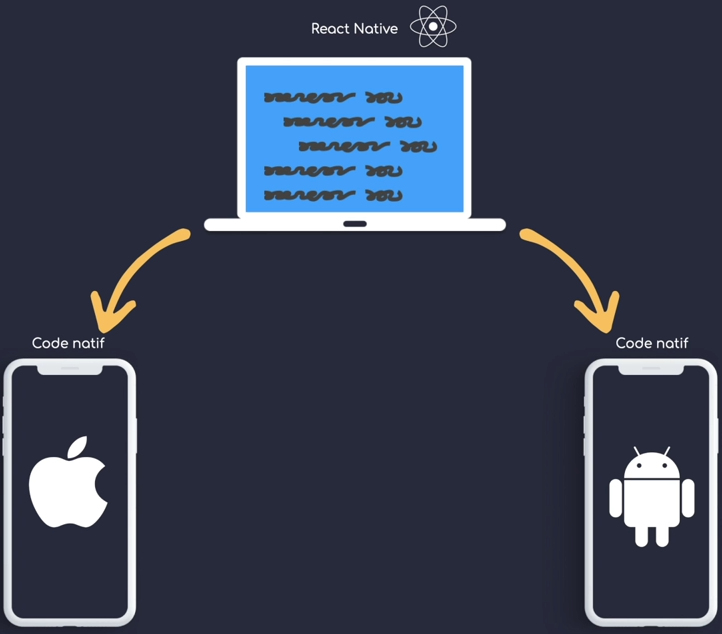
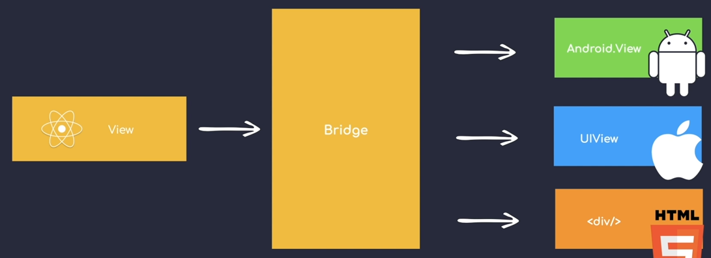
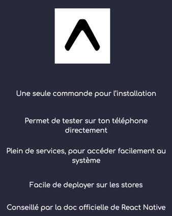

# Introduction

## Comment fonctionne React Native

Pour faire face aux problèmes que peuvent apporter le développement d'applications Swift / Kotlin (deux développement pour une app, budget, temps) et PWA (Progressive Web Apps, performances plus faibles), React Native a vu le jour.

On écrit du code React Native, qui est ensuite transformé via un bridge en code natif Android, IOS ou même Web.

## Expo

[Voir la documentation officielle](https://docs.expo.dev/)

Expo est un client qui va nous permettre d'initialiser une application React Native. Il est aussi possible d'utiliser le CLI React Native standard, mais Expo apporte quelques fonctionnalités pratiques et reste le plus utilisé.

Expo permet aussi d'accéder à [Expo Snack](https://snack.expo.dev/) qui est un environnement playground pour écrire son code React Native et le tester sur des émulateurs ou son propre device.
